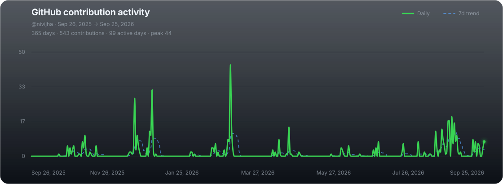

<h1 align="center">Hi 👋, I'm Nivi Jha</h1>

  <strong>Backend / Full-Stack Developer · Problem Solver</strong>

  <a href="https://nivijha-portfolio.vercel.app/">Portfolio</a> •
  <a href="https://leetcode.com/u/vinj21/">LeetCode</a> •
  <a href="https://codolio.com/profile/CRPSfhtT/card">Codolio</a> •
  <a href="https://www.linkedin.com/in/nivi-jha">LinkedIn</a>

---

## 👩‍💻 About Me

I'm a **B.Tech CSE student at Jaypee University of Information Technology (JUIT)** focused on building reliable **backend and full-stack applications**.

I enjoy working on systems where engineering decisions matter — from **API design, caching and authentication** to **testing, CI/CD, cloud services and AI integrations**.

* 🔭 Currently building and improving **backend-focused applications**
* 💻 Strongest stack: **JavaScript / Node.js / Express / MongoDB**
* 🧠 Solving **DSA primarily in Java** — 300+ LeetCode problems
* ☁️ Learning **System Design & Cloud Architecture**
* 🤖 Exploring practical **AI/ML integrations**
* 🌱 Open to **SDE, Backend and Full-Stack opportunities**

---

## 🚀 Featured Projects

### 🏥 MedTracker

**Healthcare management platform with AI-powered medical document understanding**

* Backend built with **Node.js, Express and MongoDB**
* Implemented **Redis cache-aside architecture** with MongoDB as the source of truth
* Integrated **LLM provider fallback** for AI analysis
* Added automated testing with **Vitest + Supertest + in-memory MongoDB**
* CI/CD through **GitHub Actions**

**Focus:** Backend Architecture · Redis · MongoDB · REST APIs · Testing · CI/CD · AI Integration

---

### 🌌 Chat Constellation

**Graph-based conversational interaction visualization platform**

* Built with **React, Node.js, Express and MongoDB**
* Containerized services using **Docker Compose**
* Implemented authentication and API-based communication
* Used **Nginx** for service orchestration / routing

**Focus:** Full Stack · REST APIs · Authentication · Docker · MongoDB · Nginx

---

### 🫀 CardioVision

**Deep-learning based coronary artery stenosis detection**

* Developed computer-vision models using **YOLOv8**
* Built an inference API using **FastAPI**
* Worked with angiography datasets including **ARCADE**
* Explored cross-dataset validation and model generalization
* Integrated model inference into a deployable application

**Focus:** PyTorch · YOLOv8 · OpenCV · FastAPI · Computer Vision · Medical AI

---

### ☁️ AI Product Review Analyzer

**Serverless product-review analysis application**

* Built around **AWS Lambda** and **Amazon Comprehend**
* Performs sentiment and key-phrase analysis on product reviews
* Uses a serverless architecture for processing review data

**Focus:** AWS Lambda · Amazon Comprehend · Serverless Architecture

> Deployment status may vary; see the repository for the current implementation.

---

## 🧠 Problem Solving

I primarily solve DSA problems in **Java** and use problem solving to strengthen my understanding of algorithms and data structures.

**Topics I actively practice:**

`Arrays` · `Hashing` · `Binary Search` · `Sliding Window` · `Two Pointers` · `Stacks` · `Graphs` · `BFS / DFS` · `Dijkstra` · `Greedy` · `Union Find` · `Dynamic Programming`

---

## 🛠️ Tech Stack

### Languages

  
  
  
  

### Backend & Databases

  
  
  
  

**Also:** REST APIs · JWT · Google OAuth 2.0 · Redis

### Frontend

  
  
  
  
  

### Cloud, DevOps & Tools

  
  
  
  

**Also:** GitHub Actions · Docker Compose · Vercel · Render · Bash

---

📈 GitHub Activity</h2>

  

--- 

## ♨️ DSA Analytics

  

---

## 🤝 Let's Connect

I'm interested in opportunities and collaborations around:

**Backend Engineering · Full-Stack Development · AI Applications**

  
  
  
  

